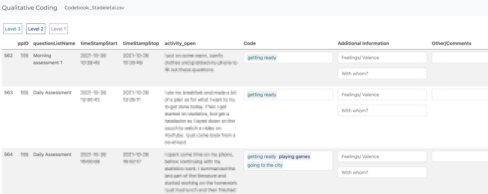
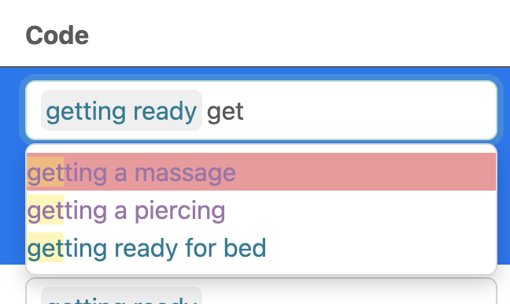
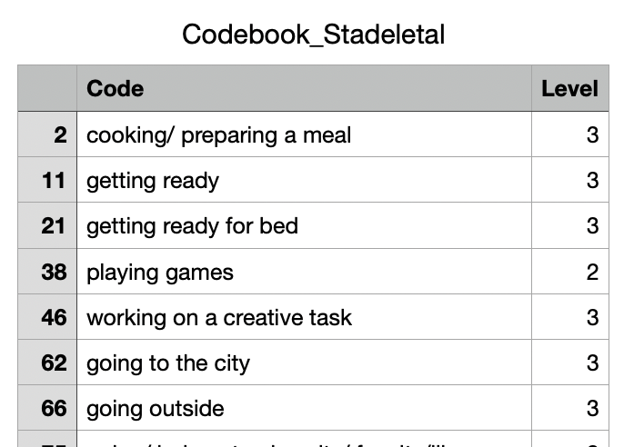
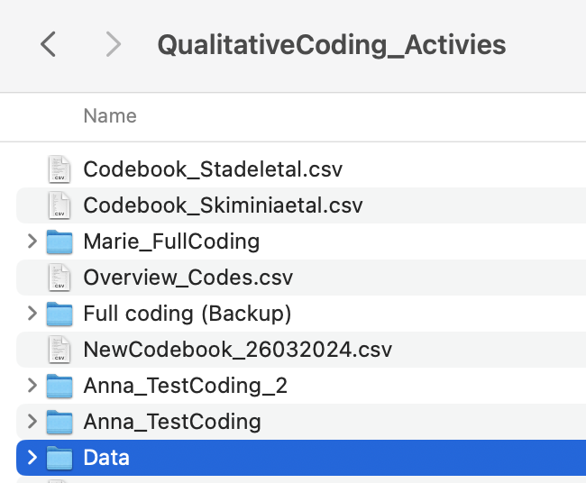
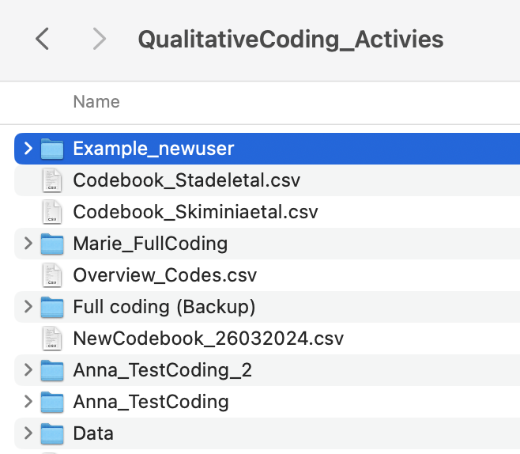
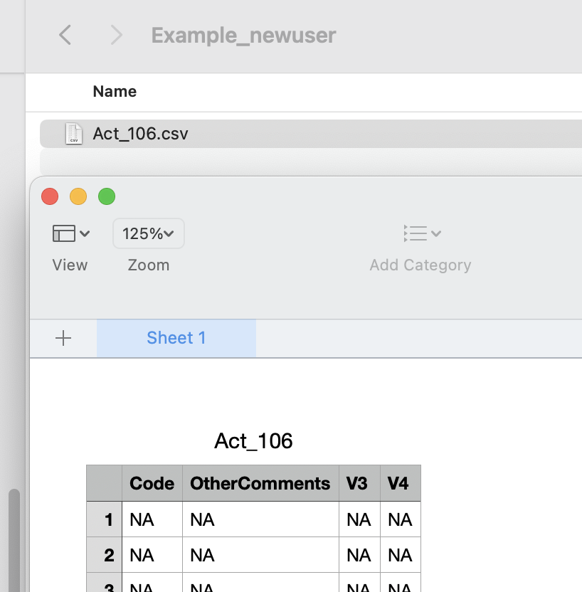
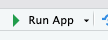

## Shiny App to Code Qualitative ESM data

Here we provide a shiny app that can be used by other researchers to
code open-ended ESM data based on a given coding scheme. It contains
several columns showing the raw observation (see screenshots below
“activity_open”), the given code (“Code”), and additional information
(such as feelings or who the activity was with). Our codes have a
hierarchical structure and are therefore displayed in different colors.

This app was build as part of the project “Assessing Daily Life
Activities: Comparing Predefined Categories with the Qualitative
Analysis of Open-Ended Responses in Experience Sampling Methodology
(ESM)” Marie Stadel, Anna Langener, Laura Bringmann.



The codes appear interactively as you type.



To use this app, please download and open the app_Lorentz.R file in R studio. 

Additionally you will need a datafile and codebook. For this workshop
we will use the following files: 
data_respproc.csv (to be downloaded from the google drive workshop folder)
Codebook_responseprocess.csv (to be downloaded from this repository)


## How to use this app?

The following sections explain how to set up this app. You only need to
change the first few lines of code in the app (Six lines in total). Here
is a little more explanation of what you need to change.

#### 1) Select the folder in which the codebook is stored and the results will be saved.

First, you need to select your project folder where you want to save
your coding results. Ideally, this folder will also contain the file
where your codebook is stored. This can be any folder on your computer
or in a cloud. When typing the filepath for the directory, make sure 
there is a slash / at the end. 

``` r
# 1. Select the folder in which the codebook is stored and the results will be saved
Projectwd <- "/Users/annalangener/Nextcloud/Shared/Testing Methods to Capture Social Context/Qualitative context/3. Coding/QualitativeCoding_Activies/"
```

#### 2) Select the coding scheme that you want to use.

Next you need to read in the codebook. 
Below we also provide sample code to read a codebook stored in an Excel
file. The codebook should look similar to this:



**Important**: The codebook must contain a column named “Code”
containing the codes. If desired, the codebook can contain a second
column called “Level”. This can be used if the codes have a hierarchical
structure and you want to display them in different colors.

``` r
# 2. Select the coding scheme that you want to use. 
# You can choose our proposed coding scheme, the coding scheme proposed by Skimina et al., or you own by specify the path where the codebook is stored.
# For this workshop we will use the Codebook_responseprocess.csv file.
# IMPORTANT: The codes need to be in a column named "Code" and if levels are included, those need to be in a column called "Level"
#Codebook_Act <- read_excel(paste(Projectwd,"Codebook_shared_activities.xlsx",sep =""), sheet = 1)
Codebook <- "Codebook_Stadeletal.csv" # Needed
Codebook_Act <- read.csv(paste(Projectwd,Codebook,sep ="")) 
```

#### 3) Select the path where the data is stored.

Specify where your data is stored in your project folder. In our
example, we created a subfolder called “Data” that contains our data
file. See the image below for an example of how our project folder is
structured. 



To be able to code activities / events spanning over multiple observations 
(e.g. someone is on vacation), the dataframe should be sorted by date. 
Below we provide sample code on how to do this.

``` r
# 3. Select the path where the data is stored
Data <- read.csv(paste(Projectwd,"Data/act_coding_ALL.csv",sep = ""))[,-1]
# The dataframe should be sorted by Date, to allow for context coding
#Data <-  Data %>% arrange(ppID, timeStampStart)
#write.csv(Data,paste(Projectwd,"Data/act_coding_ALL.csv",sep = ""))
```

#### 4) Select who is coding.

The next step is to select who will be coding (this can be useful if
more than one researcher is coding on a project). You can choose any
name you like. If you choose a new username, a subfolder will
automatically be created for that user (see image below), if an “old”
user is selected, the previous codes will be read into the app and the
user can continue coding where they left off.

``` r
# 4. Select who is coding (a folder will be created if this is a new person)
User <- "Example_newuser"  # "Marie_FullCoding", "Marie", "Anna"
```

In this example, a new folder named “Example_newuser” **automatically**
be created in our project folder to store the results for this user.



#### 5) Indicate how your column is named that includes the participant IDs and select the participant that you want to code

To reduce loading time and to be able to code the context of an
observation, we load each participant’s data separately. The first time
we load a participant’s data, a csv file is automatically created to
store the coding results (until there are results to store, it will
contain “NA”).

``` r
# 5. Indicate how you column is named that includes the participant IDs and select the participant of interest
id_column = "ppID" # Change the name of the column here; for the workshop this is not needed 
ppID <- 1 # Choose a participant you want to code, the ids range from 1 until 11
```



#### 6) Indicate whether your codebook contains different levels.

You can set Levels to FALSE if your codebook does not have a
hierarchical structure or if you do not want to display them in
different colors.

``` r
# 6. Indicate whether your codebook contains different levels?
Levels = TRUE #FALSE
```

#### 7) Click “Run App”

Lastly, you only have to click “Run App”.



## Analyze the data

This repository also contains some simple R code to start analyzing the
data:
[Results_Analysis.Rmd](https://github.com/AnnaLangener/QualitativeCodingApp/blob/Anna_Tests/Results_Analysis.Rmd "Results_Analysis.Rmd").
For example, we provide some code to read the results from each
participant and calculate the frequency of how often a particular code
was used.

## Questions/Problems?

Write an email to a.m.langener\[at\]rug.nl, langener95\[at\]gmail.com,
or m.stadel\[at\].rug.nl
